# Apartment pricing model for Porto Alegre
___

**Description:** Machine Learning algorithms were used to create a pricing model to predict apartment price in Porto Alegre city, in Brazil. The [Final Report](https://github.com/x-cohen/porto_alegre_apartments_model_prices/blob/master/Report_english_version.pdf) is available in pdf file format. The work was divided into four stages/notebooks:

- [Data Scaper Notebook](https://github.com/x-cohen/porto_alegre_apartments_model_prices/blob/master/1_web_scraper_foxter.ipynb)
- [Data Wrangling Notebook](https://github.com/x-cohen/porto_alegre_apartments_model_prices/blob/master/2_data_wrangling_foxter.ipynb)
- [Data Exploration Notebbook](https://github.com/x-cohen/porto_alegre_apartments_model_prices/blob/master/3_exploratory_data_foxter.ipynb)
- [Data Modeling Notebook](https://github.com/x-cohen/porto_alegre_apartments_model_prices/blob/master/4_modeling_foxter.ipynb)


**Key Skills:**
- Data capture with BeautifulSoup and Request
- Data wrangling using Pandas
- Data visualization using Ploty, Seaborn and Matplotlib
- Descriptive statistics
- Machine Learning using scikit-learn
    - Features selection with eli5
    - Algorithms: Linear Regression, Lasso, Elastic Net, K-Neighbors Regressor, Decision Tree Regressor, Support Vector Regression, AdaBoost Regressor, Gradient Boosting Regressor, RandomForestRegressor, ExtraTreesRegressor, XGBRegressor.

___
## [Data Scaper Notebook](https://github.com/x-cohen/porto_alegre_apartments_model_prices/blob/master/1_web_scraper_foxter.ipynb)

The purpose of this notebook is to collect data from Foxter Real State company site on the Internet using a Web Scraper. This is the first step into the project to estimate prices of apartments.

In this notebook, the Web Scraper will:
- download the sitemap.xml
- visit each page in sitempa.xml file
- collect data of each page, but some pages will be ignored (some conditionals if are specified)
- in each page visited, the scaper will collect new address of new pages
- at the end, all data collected will be saved in a pandas dataframe.


**Main Strategy**

The Web Scraper was constructed, in its main core, with BeautifulSoup, Requests and Pandas. The BeautifulSoup turned easy to collect the data from every page. The Requests library made the connection possible to get the data. And Pandas was used to save the data collected into a sigle dataframe.

___
## [Data Wrangling Notebook](https://github.com/x-cohen/porto_alegre_apartments_model_prices/blob/master/2_data_wrangling_foxter.ipynb)

The purpose of this notebook is to clean the data collected from Foxter Real State company website. This is the second step into the project.

This notebook will execute the actions below:
- Drop unnecessary columns
- Convert columns to right formats
- Verify and clean columns
- Identify repeated elements
- Handling missing values - NaNs
- Remove outliers
- Save the final dataframe to .csv file

#### Outliers identification

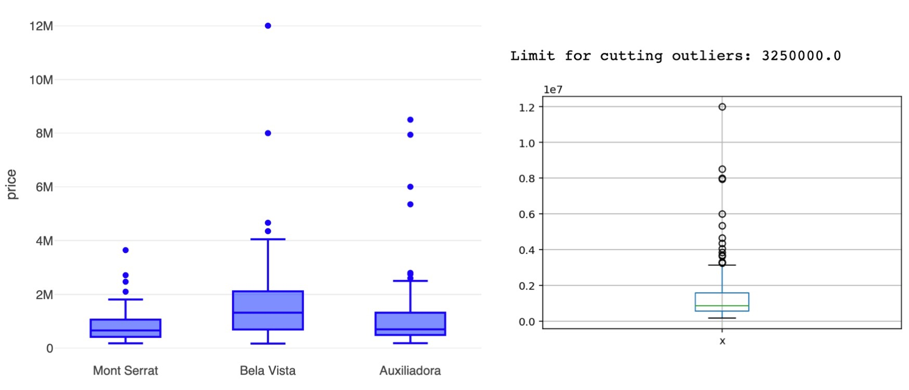


___
## [Data Exploration Notebbook](https://github.com/x-cohen/porto_alegre_apartments_model_prices/blob/master/3_exploratory_data_foxter.ipynb)

This notebook was prepared to show the Exploratory Data Analysis (EDA) about the real state prices in Porto Alegre (Brazil). This is the third stage in the project.


**Research Questions**

1. What are the statistics that describe the sample?
2. What are the features that have the highest degree of correlation with each other?

___
**Histograms**

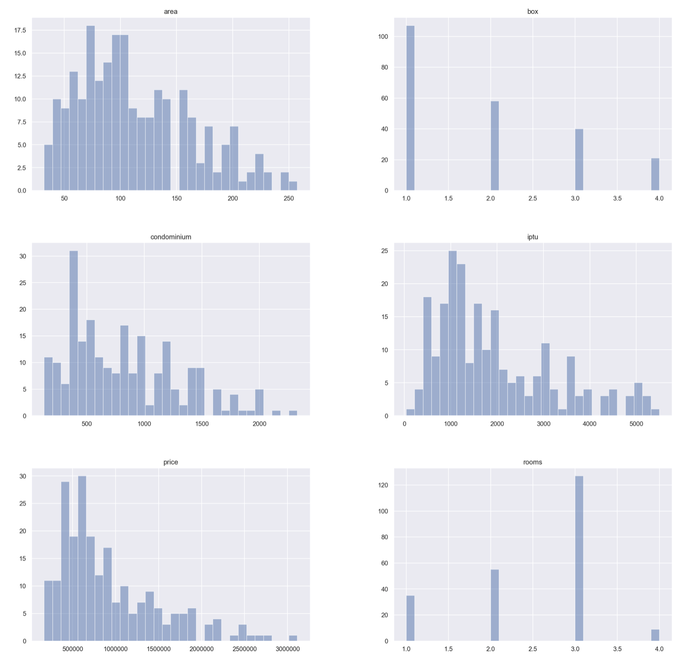


___
**Charts**
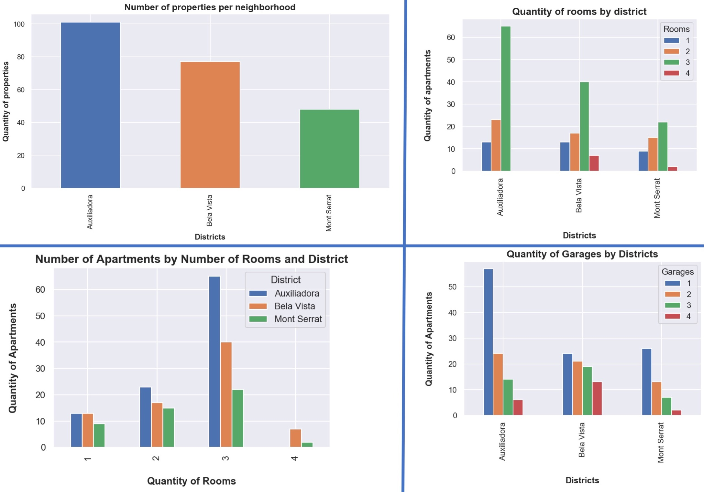


___
**Boxplots**
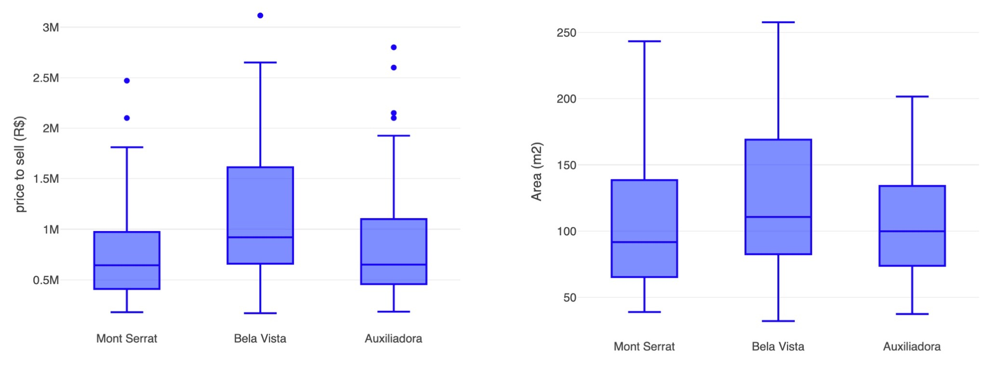


___
**Pairplots**
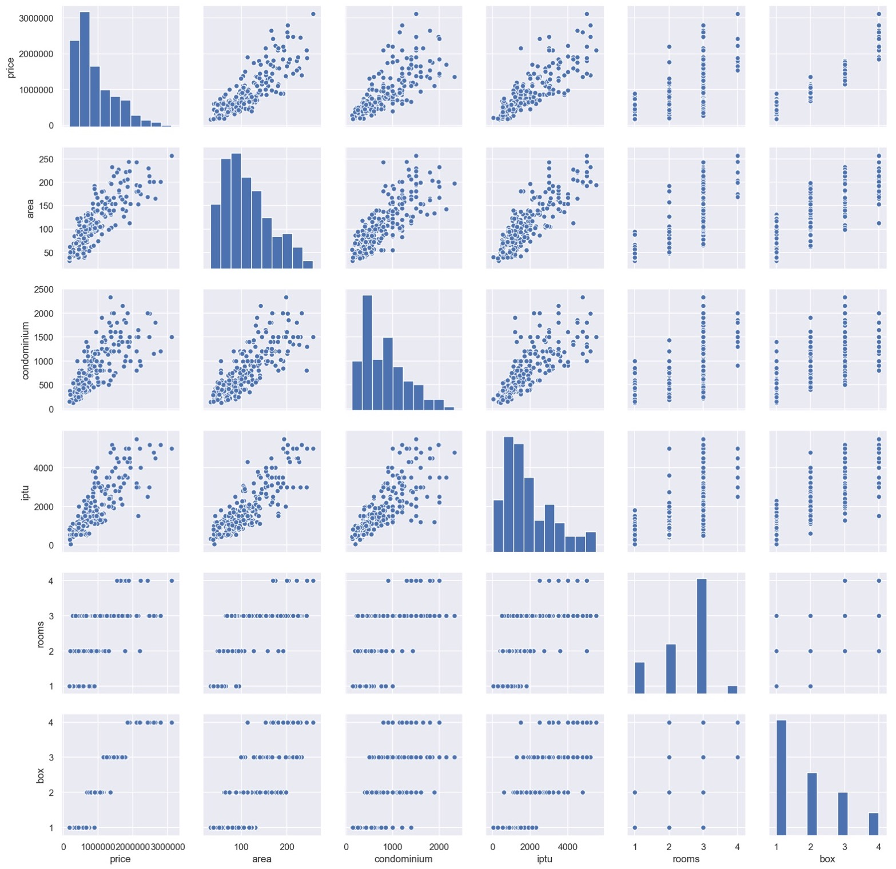

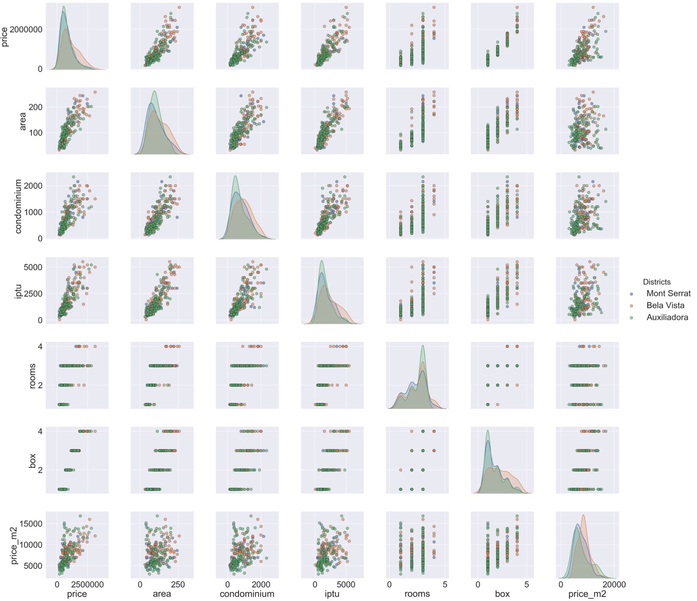


___
**Correlations**
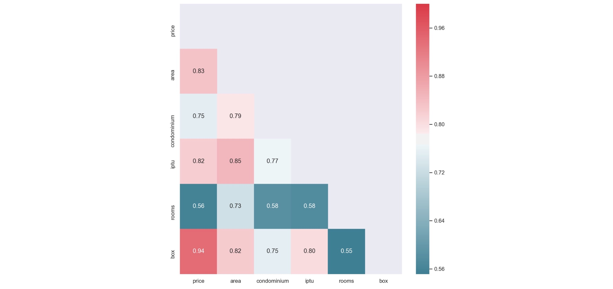


___
**Scatter Plots**
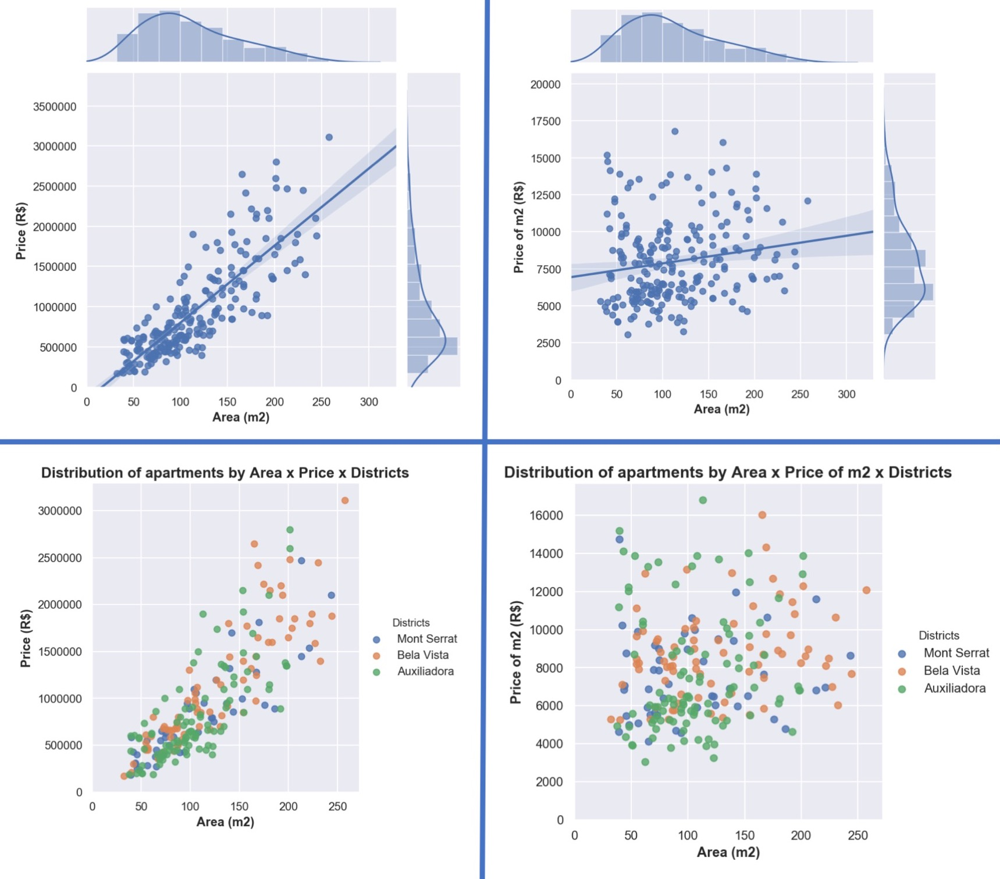

___
## [Data Modeling Notebook](https://github.com/x-cohen/porto_alegre_apartments_model_prices/blob/master/4_modeling_foxter.ipynb)

The purpose of this notebook is to develop a machine learning model to predict apartments prices. This is the fourth notebook into the project, and here we have:

1. Import and check the dataset
2. Feature Engeneering: Transform categorical variables to dummies
3. Make train and test spit
4. Make features selection
5. Create a baseline model
6. Evaluate algorithms
7. Tune the best
8. Specify a final model
9. Predict the price of a particular property


#### Research Questions

**Main Question:**
- What is the selling price of a used apartment in the city of Porto Alegre?

**Secondary Questions:**
1. What is the best algorithm for the sample studied?
2. What attributes have the most influence on the sale price?


___
**Features Selection**
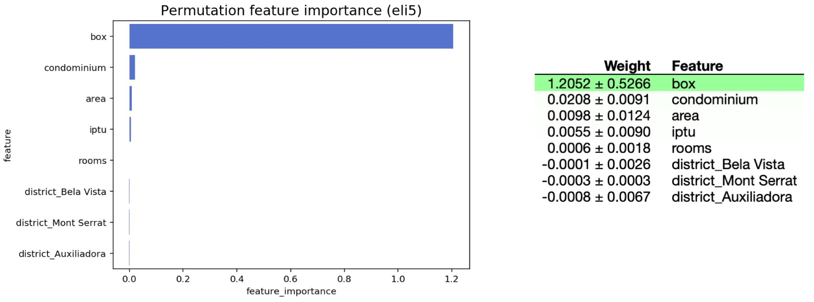


___
**Algorithms Comparation**
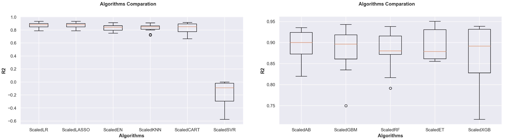

___
**Final Model Features**
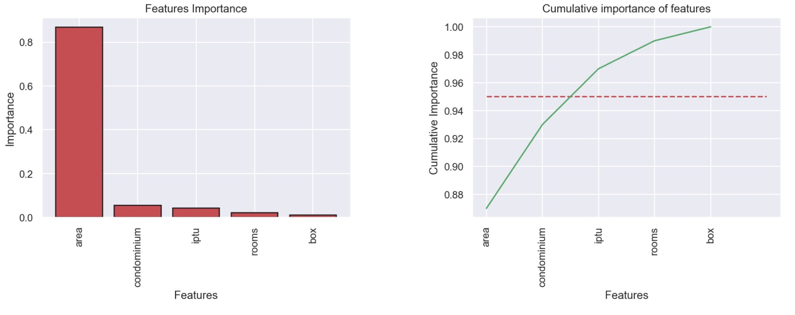


```python

```
